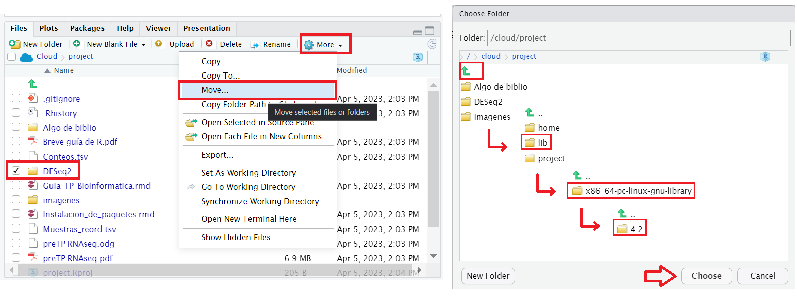

En R, los paquetes son conjuntos de herramientas que otras personas desarrollaron y pusieron a disposición de la comunidad. En este trabajo vamos a usar diferentes paquetes para el manejo, análisis y visualización de datos. En particular, vamos a usar muchos paquetes pertenecientes a la familia de Bioconductor que, dentro del universo de R, incluye herramientas especializadas para el trabajo con datos de biología molecular (principalmente datos de secuencias). Para usar un paquete en R hay que realizar dos pasos: instalarlo (lo cual hacemos una única vez) e importarlo al espacio de trabajo de la sesión de R (lo cual repetimos cada vez que abramos el proyecto/script). Para instalar todos los paquetes de Bioconductor requeridos para este TP, vamos a usar el paquete Biocmanager:

1.  <div>

    ```{r}
    install.packages('BiocManager')

    # Corer las siguientes lineas de a una:
     # esperar a que termine cada una para correr la siguiente
     # debe decir "DONE (nombre.del.paquete)" al finalizar cada una
    BiocManager::install('vsn', force = T)
    BiocManager::install('S4Vectors', force = T)
    BiocManager::install('IRanges', force = T)
    BiocManager::install('GenomicRanges', force = T)
    BiocManager::install('SummarizedExperiment', force = T)
    BiocManager::install('BiocParallel', force = T)
    BiocManager::install('geneplotter', force = T)
    BiocManager::install('locfit', force = T)
    
    BiocManager::install('GenomeInfoDbData', force = T)


    ```

    </div>

Además de las herramientas específicas para trabajar con datos de biología molecular, vamos a usar otras que sirven para, por ejemplo, manejar más fácilmente las tablas de datos o generar gráficos elaborados. Para instalarlos, definimos una lista de nombres (cran.p), que luego le pasamos a la función install.packages.

```{r}

cran.p=c("dplyr", # manipulación de datos
         "tidyr", # manipulación de datos
         "ggplot2", # generación de gráficos
         "pheatmap", # gráficos de mapas de calor
         "RColorBrewer", # paletas de colores para los gráficos
         'gridExtra', # agrupación de múltiples gráficos
         'Rcpp',
         'colorspace') # configuraciones de color para los gráficos

# Que instalamos corriendo las siguientes lineas.

new.packages=cran.p[!(cran.p %in% installed.packages()[,"Package"])]

if (length(new.packages)>0) {
  install.packages(new.packages)
}


```

Hay un último paquete que vamos a necesitar y que, como es muy pesado para descargar e instalar desde la nube, es necesario cargarlo manualmente al espacio de trabajo de R cloud. Para esto, seleccione la carpeta DESeq2, click en el engranaje que dice *More \> Move...*, vamos hasta ../lib/x86_64-pc-linux-gnu-library/4.2/, click en Choose.



Para ver si la instalación de paquetes, y la carga manual de DESeq2, funcionaron, vamos a intentar "abrir" estos paquetes (cargarlos en el espacio de trabajo) con la función require.

```{r}

# Creamos una lista de nombres de los paquetes

pckg.ls=c(# análisis de datos moleculares (bioconductor)
  "DESeq2", "vsn",
  # otros paquetes
  "dplyr", "tidyr", # manipulación de datos
  "ggplot2", # generación de gráficos
  "pheatmap", # gráficos de mapas de calor
  "RColorBrewer", # paletas de colores para los gráficos
  'gridExtra', # múltiplies gráficos en un único panel
  'colorspace' # configuraciones de color
)

# E importamos los paquetes de esa lista
lapply(pckg.ls, # para cada nombre de la lista de paquetes instalados...
       require, # aplicar la función "require" para importarlo
       quietly =T,
       character.only = TRUE) # (ignorar este argumento, es para las mañas de R)

```

Si todos dieron TRUE, entonces ya puede comenzar a trabajar con la guía del TP.
